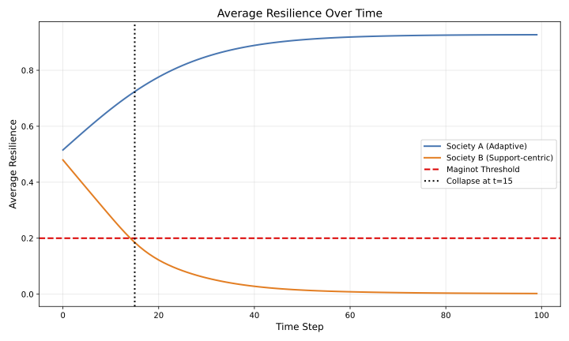
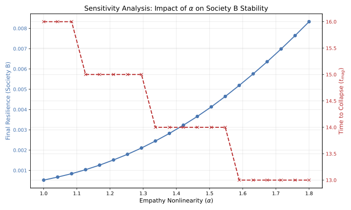
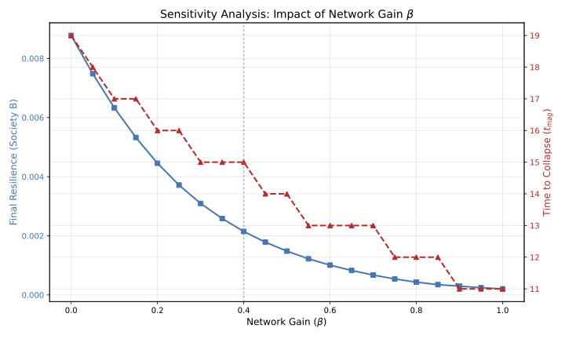

# The Paradox of Scale in Social Stress Dynamics:
## Evolutionary Mismatch, Policy Regimes, Network Gain, and the Maginot Time

**Author:** Sunchul Jung (`zotanika@gmail.com`)

---

### Abstract

This paper proposes a theoretical framework for social stress dynamics that combines ideas from information theory, control theory, and a stylized model of policy regimes. We treat human empathy as a *local damping mechanism* that evolved to absorb variance and stress in small, weakly coupled groups (the ancestral environment). However, in modern hyper-connected networks—especially digital environments with near-zero latency and global reach—the same mechanism can operate in a domain of "evolutionary mismatch."

On top of this structural mismatch, we compare two idealized policy/cultural regimes:
1.  An **adaptive/autonomy-oriented regime (Society A)** that encourages individual autonomy and problem-solving, and treats moderate stress as an opportunity for learning and capability expansion; and
2.  A **support-centric regime (Society B)** that emphasizes empathy, protection, and external assistance, and attempts to quickly buffer individual stress at the system level.

The two societies share the same distribution of empathy and the same initial distribution of psychological resilience.

We define perceived stress as a function of empathy ($E$), network coupling ($G$), and policy regime, and model how these factors jointly shape the dynamics of resilience and grouping (identity clustering) using simple difference equations. Through a minimal agent-based simulation—extended in this version to include local network topology and Small-World interactions—we show that even under identical initial conditions and external stimuli, Society A and Society B can diverge dramatically over time: Society A tends to converge to a high-resilience equilibrium, while Society B tends to exhibit declining average resilience and increasing grouping.

In addition to this specific two-regime model, we formulate a more abstract framework in which stress is generated by a monotone function of empathy and grouping, and resilience is updated by a monotone function of current resilience and stress. Under weak structural assumptions, we prove a general monotonicity result: for any policy regime, empathy distribution, and use of social resources, any trajectory of grouping that is pointwise lower at all times yields weakly higher resilience at all times and a weakly later collapse time.

Within this toy setting, we define a "**Maginot Time**" ($t_{\text{mag}}$) at which average resilience falls below a critical threshold, and show that policies that structurally encourage group dissolution can only delay (never accelerate) this crossing, provided the monotonicity assumptions hold.

The model is intentionally simplified and *not* intended as a literal description of any real country or ideology; rather, it aims to illustrate a structural perspective in which empathy, network gain, grouping, and policy regimes interact to shape long-run social fragility.

---

## 1. Introduction

Contemporary societies exhibit multiple forms of fragility: severe polarization, chronic stress, and rapid escalation of seemingly minor conflicts. Public discourse and social science often frame these issues in moral or ideological terms:
Who is right and wrong?
Is there too little or too much empathy?
Is a given response "correct" or "incorrect"?

Empirical work in the social sciences has become increasingly sophisticated in survey design, statistical analysis, and big-data correlational methods. However, explicit *dynamic* models of how stress and resilience co-evolve over time—especially under different policy regimes and network structures—remain relatively rare.

From the perspective of complex systems and evolutionary biology, part of the problem may be less about moral categories and more about *structure and dynamics*. We interpret this as a particular instance of **evolutionary mismatch** [^1]. Human psychological mechanisms, including empathy and stress response systems, were shaped in small groups with weak network coupling and substantial information latency. In such environments, empathy functions as a local shock absorber: it redistributes an individual's stress across the group and thereby protects the individual from collapse.

Digital technology and social media, however, have transformed the topology of social interaction. Physical latency has shrunk to nearly zero; connectivity and interaction frequency have exploded. In the language of control theory, this dramatically increases the *loop gain* of the social signal-processing system. It is a well-known engineering fact that a feedback loop designed for stability at low gain can drive a system into oscillation or divergence at high gain.

On top of this structural shift, societies adopt very different norms and policies about how to *interpret and manage* stress. Some regimes (our Society A) emphasize autonomy, self-regulation, and confronting challenges. Other regimes (our Society B) emphasize protection, empathy, and external support. Both directions can be ethically motivated, but they may lead to very different long-run dynamics when combined with a high-gain network.

In this paper, inspired by Shannon's channel capacity [^2], system dynamics [^3][^4], and Pentland's social physics [^5], we construct a minimal dynamical model that links empathy, network gain, and policy regimes to social stress and resilience. We first analyze a concrete two-regime model (Society A vs Society B), and then show how it fits into a more abstract framework where we can prove a general monotonicity result: under weak structural assumptions, any policy trajectory that leads to lower grouping or identity clustering at all times can only improve resilience and delay collapse, regardless of the details of the regime or empathy distribution. Our goal is not to fit data, but to offer a compact formal lens for thinking about structural vulnerability in hyper-connected societies.

## 2. Information and Control-Theoretic Perspective

### 2.1 Channel Capacity and Social Bandwidth

Shannon [^2] showed that the capacity $C$ of a communication channel with signal power $S$, noise power $N$, and bandwidth $B$ is:

$$
C = B \log_2\left(1 + \frac{S}{N}\right)
$$

By analogy, we may map this to a social context as follows:
* $S$: the society's problem-solving and institutional processing power;
* $N$: social stress, conflict, and emotional noise;
* $B$: the bandwidth of public discourse (media, institutional attention, cognitive bandwidth of citizens).

Crucially, the "noise" $N$ here is not exogenous white noise. It is endogenous to the system: perceived noise depends on (1) the population distribution of empathy, and (2) how network topology amplifies or dampens stress signals.

### 2.2 Empathy as a Feedback Gain Element

We treat empathy not just as a virtue but as a **feedback gain element** in the social system. Higher empathy means greater sensitivity to other people's emotional states and stress signals.

* **Weakly coupled networks (local damping):** When connections are sparse and latency is high, an individual's stress is shared with a small neighborhood and then decays. Empathy in such a setting primarily redistributes stress locally and acts as a negative feedback mechanism.
* **Strongly coupled networks (global resonance):** When connections are dense and latency is low, stress signals spread widely and rapidly. Highly empathetic individuals absorb these signals, experience secondary stress, and retransmit them. If the loop gain is sufficiently large, empathy becomes part of a positive feedback loop that amplifies stress rather than damping it.

This is analogous to the Larsen effect in audio systems: microphones are not "bad," but when the gain and feedback path are configured in certain ways, they contribute to runaway howling.

## 3. Mathematical Model: Two Policy Regimes

In this section we specify a concrete two-regime model for stress and resilience dynamics. In Section 4, we will step back and embed this model in a more abstract framework that yields a general structural result.

### 3.1 Perceived Stress

We define the perceived stress $S_i(t)$ of individual $i$ at time $t$ as:

$$
S_i(t) = E_i^{\alpha} \bigl( 1 + \beta G_t \bigr)
$$

where:
* $E_i \sim P(E)$: the empathy level of individual $i$ (sensitivity to social signals).
* $G_t \in [0,\infty)$: a scalar index of grouping / network coupling at time $t$.
* $\alpha > 1$: a nonlinearity exponent; higher $\alpha$ means that high-empathy individuals experience disproportionately higher stress.
* $\beta \ge 0$: a **network gain** parameter; higher $\beta$ means the same grouping level $G_t$ produces more amplification.

When $\beta \approx 0$, stress is largely a function of individual empathy and local conditions. As $\beta$ increases, the same empathy distribution can yield much higher overall stress and stronger cross-sectional correlations.

### 3.2 Two Policy Regimes: Society A and Society B

We now assume:
* The empathy distribution $P(E)$ is the same in both societies.
* The functional form of perceived stress is the same.
* Society A and Society B differ only in how resilience $R$ and grouping $G$ are updated over time, reflecting different policy/cultural regimes.

We denote individual resilience in Society A and Society B as $R_i^A(t)$ and $R_i^B(t)$, respectively, with $R_i^\cdot(t) \in [0,1]$.

**Resilience dynamics:**
Resilience evolves differently under the two regimes:

$$
\begin{aligned}
R_i^A(t+1) &= R_i^A(t) + k_A\, R_i^A(t)\bigl(1 - R_i^A(t)\bigr) - \lambda_A\, S_i^A(t) \\
R_i^B(t+1) &= R_i^B(t) - k_B\, S_i^B(t) + d_B
\end{aligned}
$$

**Interpretation:**
* **Society A (adaptive/autonomy-oriented):**
    * The term $k_A R(1-R)$ captures an *adaptive learning effect*: individuals who are allowed (and encouraged) to face manageable levels of stress can grow their resilience.
    * The term $\lambda_A S_i^A$ captures erosion from stress; as long as stress is not too high and $R_i^A$ is in a mid-range, the growth and erosion terms can balance in favor of net growth.
* **Society B (support-centric):**
    * The term $-k_B S_i^B$ captures erosion of resilience under stress.
    * The constant $+d_B$ represents external support (welfare, protection, emotional assistance) that maintains a baseline level of resilience. On its own, this term stabilizes but does not inherently promote growth in $R$.

In both societies, stress is computed via $S_i(t) = E_i^{\alpha} (1 + \beta G_t)$ with their respective grouping indices.

**Grouping dynamics:**
We model the evolution of grouping / coupling $G_t$ separately for the two regimes:

$$
\begin{aligned}
G_{t+1}^A &= G_t^A (1 - \eta_A) \\
G_{t+1}^B &= G_t^B + \gamma_B\, C_t^B - \eta_B G_t^B
\end{aligned}
$$

where:
* $C_t^B = \frac{1}{N} \sum_{i=1}^N S_i^B(t)$ is the average stress (a proxy for social cost) in Society B.
* $\eta_A > 0$: the rate at which Society A de-emphasizes group labels ("de-grouping").
* $\eta_B > 0$: the rate at which grouping decays in Society B (typically smaller).
* $\gamma_B > 0$: the sensitivity with which stress drives grouping and identity-based mobilization in Society B.

Society A, as an idealized extreme, tends to reduce the salience of group labels and approach more individual-centered rules over time. Society B, as the opposite idealization, tends to form and strengthen identity clusters in response to stress.

### 3.3 Parameter Interpretation

* $\alpha > 1$: degree of nonlinear amplification of stress by empathy.
* $\beta \ge 0$: network gain; controls how strongly grouping $G$ amplifies stress.
* $k_A > 0$: speed at which experience (challenge) is converted into resilience growth in Society A.
* $\lambda_A > 0$: rate at which stress erodes resilience in Society A.
* $k_B > 0$: stress-induced erosion coefficient in Society B.
* $d_B > 0$: level of external support that maintains resilience in Society B.
* $\eta_A > 0$: de-grouping rate in Society A.
* $\eta_B > 0$: de-grouping rate in Society B.
* $\gamma_B > 0$: sensitivity of grouping in Society B to overall stress.
* $R_{\text{crit}}$: critical resilience threshold used to define the Maginot Time.

## 4. A General Structural Result on Grouping

The two-regime model above makes strong, specific assumptions about how stress and resilience evolve. In this section we step back and show that a key qualitative claim—that systematically "de-grouping" improves resilience and delays collapse—can be derived in a much more general setting.

### 4.1 Abstract Framework

Consider a population of $N$ individuals, each with a fixed empathy parameter $E_i$. We assume:
* A *stress function* $H(E,G)$ that maps empathy $E$ and grouping level $G$ to nonnegative stress.
* A *resilience update function* $F(R,S;\theta)$ that maps current resilience $R$, stress $S$, and a vector of regime parameters $\theta$ to next-period resilience.
* Initial conditions $R_i(0)$ are given and identical across comparisons.

We impose weak monotonicity assumptions:
1.  **Grouping increases stress:** For $G_1 \le G_2$, $H(E,G_1) \le H(E,G_2)$.
2.  **Stress erodes resilience:** For $S_1 \le S_2$, $F(R,S_1;\theta) \ge F(R,S_2;\theta)$.
3.  **Resilience is self-reinforcing:** For $R_1 \le R_2$, $F(R_1,S;\theta) \le F(R_2,S;\theta)$.

### 4.2 Monotonicity and Maginot Time

Comparing two grouping paths $G_t$ and $\tilde{G}_t$ where $\tilde{G}_t \le G_t$ for all $t$:
* **Proposition 1 (Lower grouping improves resilience):** The resilience trajectory under $\tilde{G}$ will be pointwise greater than or equal to that under $G$ for all individuals and times.
* **Proposition 2 (Lower grouping delays collapse):** If we define the Maginot Time $t_{\text{mag}}$ as the first time average resilience falls below a threshold $R_{\text{crit}}$, then $t_{\text{mag}}(\tilde{G}) \ge t_{\text{mag}}(G)$.

This result confirms that "less grouping" is a structurally safe direction for resilience, regardless of specific regime parameters, provided the monotonicity assumptions hold.

## 5. Simulation Study and Extended Robustness

### 5.1 Basic Setup

We implement the model using a simple Monte Carlo simulation ($N = 10,000$, $T = 100$). Empathy is drawn from a mixture of two Gaussians. Initial resilience and grouping are identical across societies.

### 5.2 Trajectory Comparison: Society A vs Society B

**Figure 1: Average resilience trajectories.**
Society A gradually reduces grouping and converts moderate stress into resilience growth, converging to a high-resilience equilibrium. Society B experiences declining average resilience and eventually crosses the critical threshold $R_{\text{crit}} = 0.2$ at $t \approx t_{\text{mag}}$.

### 5.3 Sensitivity to Empathy Nonlinearity $\alpha$

**Figure 2: Sensitivity of Society B to the empathy nonlinearity exponent $\alpha$.**
In this toy model, larger $\alpha$ implies more disproportionate stress among high-empathy individuals, which tends to lower resilience and bring collapse earlier.

### 5.4 Sensitivity to Network Gain and Topology

A potential critique of the mean-field model ($G_t$ as a global scalar) is that it ignores the complex clustering and local interactions typical of real social networks. To address this, we extended the simulation to support **Local Coupling** using a Small-World network model (Watts-Strogatz).

In this extended mode:
* Agents are nodes in a network with average degree $k=20$ and rewiring probability $p=0.1$.
* Grouping $G$ becomes a local variable; for agent $i$, stress is influenced by the local anxiety of their neighbors rather than the global average.
* Specifically, the stress-driven grouping update for Society B uses $C_{i}^B = \text{mean}(S_{\text{neighbors of } i})$ instead of the population mean.

The simulation results confirms that the qualitative divergence between Society A and Society B is robust to this topological change. While local clustering can create "pockets of resonance" (echo chambers) where stress amplifies faster than the mean-field prediction, the overall macro-dynamic remains.

**Figure 3: Impact of Network Gain ($\beta$) on Social Stability in the Support-Centric Regime (Society B).**
As the network gain parameter $\beta$ increases, the system's ability to buffer stress diminishes rapidly. Even with high baseline support ($d_B$), a high-gain environment ($\beta > 0.5$) accelerates the arrival of the Maginot Time. This suggests that the "Paradox of Scale" is fundamentally driven by the *gain* of the network.

## 6. Maginot Time and Policy Interpretation

We define the **Maginot Time** for Society B as:

$$
t_{\text{mag}}^B = \min\{ t \,:\, \bar{R}^B(t) \le R_{\text{crit}}\}
$$

After $t_{\text{mag}}^B$, average resilience is so low that even modest shocks can push many individuals near $R_i^B \approx 0$. In this region, late interventions that merely reduce $\beta$ may struggle to restore resilience.

Proposition 2 implies that among all policies sharing the same regime parameters, those that systematically keep grouping lower will have a weakly later Maginot Time. Thus, encouraging group dissolution or de-emphasizing rigid identity clustering is a structurally safe direction.

## 7. Discussion

### 7.1 Beyond Content and Morality

Public debates often focus on the *content* of social stress (e.g., harmful speech) or on the *moral quality* of empathy. Our model suggests that even relatively benign content can generate significant stress when repeatedly amplified by a high-gain network. Structure matters:
* In a low-gain **Society A**, empathy functions as local damping.
* In a high-gain **Society B**, empathy can become part of a positive feedback loop.

### 7.2 Policy Regimes as Dynamic Design Choices

Society A and Society B are idealized extremes. In low-gain environments, both might be stable. Under high gain and strong coupling, the support-centric regime becomes fragile more quickly. Empathic support is not inherently bad; its impact depends on whether it is coupled to mechanisms that increase grouping and network gain.

## 8. Limitations and Future Work

1.  **Model simplicity:** Functional forms are chosen for interpretability.
2.  **Lack of calibration:** Parameters are conceptual.
3.  **Single scalar $G_t$:** Real networks are complex (though we partially addressed this with the Small-World extension).
4.  **Normative caution:** The model does not claim empathy is bad, but highlights structural instabilities.

Future work could replace the scalar $G_t$ with explicit dynamic network graphs and incorporate heterogeneous policy responses.

## 9. Conclusion

We have proposed a simple dynamical framework linking empathy, network gain, grouping, and policy regimes. In modern high-gain networks, the same empathy that stabilized ancestral groups can lead to divergent outcomes depending on policy interaction.

Within this toy model, a **Maginot Time** emerges—a finite horizon beyond which structural recovery becomes difficult. Theoretically, we showed that policies which keep grouping lower weakly improve resilience and delay collapse.

The goal is not to settle normative debates, but to suggest they be complemented by explicit consideration of feedback, gain, and dynamics.

## 10. References

[^1]: E. A. Lloyd, "Evolutionary mismatch," in Encyclopedia of Evolutionary Biology, Academic Press, 2011.
[^2]: C. E. Shannon, "A mathematical theory of communication," Bell System Technical Journal, vol. 27, pp. 379–423, 623–656, 1948.
[^3]: J. W. Forrester, Industrial Dynamics, MIT Press, 1961.
[^4]: J. W. Forrester, World Dynamics, Wright–Allen Press, 1971.
[^5]: A. Pentland, Social Physics: How Good Ideas Spread --- The Lessons from a New Science, Penguin Press, 2014.
